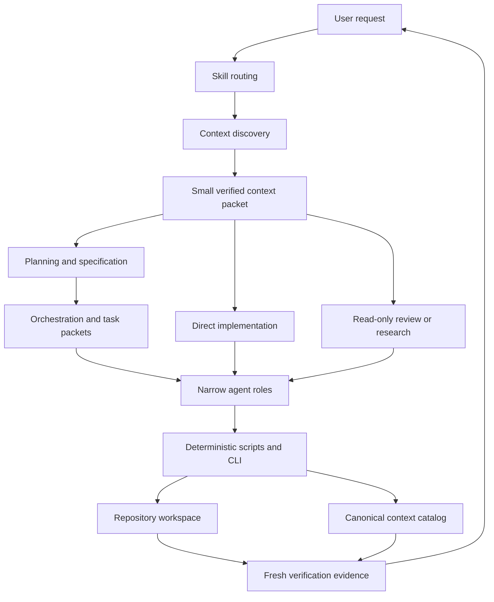
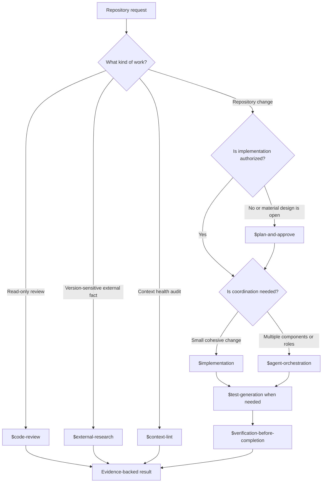
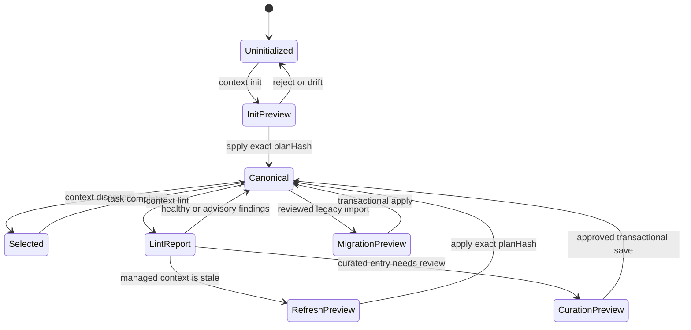
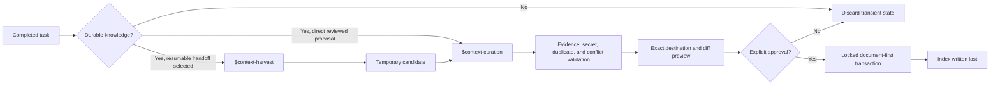
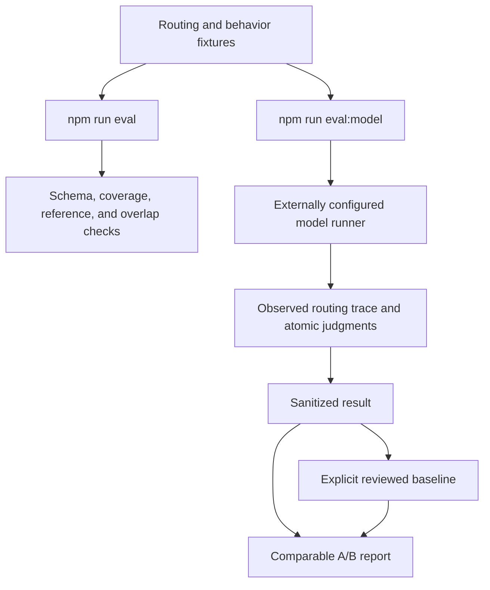

# Codex Agent

`codex-agent` is a native Codex plugin for context-aware software engineering. It combines focused skills, narrow agent roles, explicit repository context, preview-first lifecycle tools, and evidence-based verification into one portable workflow for the Codex app, CLI, and IDE extension.

The plugin is designed for a recurring problem in agentic development: a capable model still needs the right repository facts, authority boundaries, task contract, and verification evidence at the right time. Codex Agent provides those structures without loading the entire repository into every prompt or turning one large prompt into a monolithic agent.

## What the plugin provides

- Fourteen focused skills for discovery, planning, implementation, testing, review, research, context lifecycle, and verification.
- Nine narrow project agent profiles with read-only or workspace-write sandboxes matched to their responsibilities.
- An explicit, versioned context catalog under `.codex-agent/context/`, selected just in time instead of injected automatically.
- Preview-first initialization, refresh, migration, and durable-context curation with validation, backups, locking, and transactional writes.
- Ephemeral execution by default, with compact resumable Markdown handoffs only after explicit user opt-in.
- A deterministic CLI for context lifecycle and repository diagnostics.
- Offline routing and behavior-contract validation plus opt-in model-based evaluations through an external runner.
- No hard-coded model, no plugin slash-command contract, and no automatic promotion of transient task state into durable knowledge.

## Architecture at a glance

Codex Agent separates model-guided decisions from deterministic enforcement. Skills own reusable procedures; agents own bounded execution roles; scripts and the CLI own validation and state changes.



### Native Codex boundaries

| Surface | Responsibility |
|---|---|
| `AGENTS.md` | Durable instructions that should apply before repository work begins |
| Skills | Reusable workflows, trigger boundaries, and progressive disclosure through direct references |
| Agents | Narrow delegated roles with explicit sandbox and return contracts |
| `.codex/agents/*.toml` | Project-installed agent profiles generated from canonical plugin definitions |
| Hooks | Optional lifecycle reminders after trust review; never a security boundary |
| `.codex-agent/context/` | Versioned optional team knowledge selected explicitly per task |
| `.codex-agent/sessions/` | Ignored resumable handoffs created only after explicit task-level opt-in |
| Scripts and CLI | Deterministic validation, rendering, migration, locking, backup, and transactional writes |
| Marketplace | Git-backed plugin installation and distribution |

The plugin does not distribute `commands/*.md`. Interactive behavior lives in skills, while the npm CLI remains thin and deterministic.

## Install the plugin

Add this repository as a Codex marketplace and install the plugin:

```bash
codex plugin marketplace add medeiroshudson/CodexAgent
codex plugin add codex-agent@codex-agent-marketplace
```

Without `--ref`, Codex resolves the repository's default branch, currently `main`.

After new commits reach `main`, refresh the local marketplace snapshot and reinstall the plugin:

```bash
codex plugin marketplace upgrade codex-agent-marketplace
codex plugin add codex-agent@codex-agent-marketplace
```

For local development, add the absolute path to this repository as the marketplace source. Verify discovery with:

```bash
codex plugin list --available --json
```

Start a new Codex task after installation so skills, hooks, and plugin metadata are loaded cleanly.

> [!NOTE]
> Installing the plugin and initializing project context are separate operations. Installation makes the skills available immediately. Context initialization is optional and adds repository-specific guidance, indexed knowledge, and native project agent profiles.

## Choose the right workflow

You can invoke a skill explicitly with `$skill-name` or describe the intended outcome naturally. The skill descriptions define when each workflow applies.



### Recommended entry points

| Goal | Recommended workflow | Writes by default? |
|---|---|---:|
| Understand an unfamiliar area | `$context-discovery` | No |
| Plan an unapproved feature, refactor, or migration | `$plan-and-approve` | No |
| Implement a small authorized change | `$implementation` | Yes, within the authorized scope |
| Coordinate an approved multi-component change | `$agent-orchestration` | Yes, through bounded tasks |
| Add focused regression or contract coverage | `$test-generation` | Test files only |
| Review a diff, branch, or PR | `$code-review` | No |
| Verify a current external API or platform contract | `$external-research` | No |
| Prove the final integrated result | `$verification-before-completion` | Only check-generated artifacts |
| Initialize project context for the first time | `$context-init` | Preview first |
| Reconcile initialized managed context | `$context-refresh` | Preview first |
| Audit catalog health | `$context-lint` | Never |
| Extract candidates from a resumable handoff | `$context-harvest` | No durable writes |
| Save or update durable knowledge | `$context-curation` | Preview and explicit approval |

### Typical software-change flows

For a small authorized change:

```text
$context-discovery → $implementation → focused tests → $verification-before-completion
```

For a material change whose architecture is not approved:

```text
$context-discovery → architecture analysis → $plan-and-approve → user approval
→ $task-breakdown → implementation/integration → review → verification
```

For an already approved multi-component change:

```text
$agent-orchestration → discovery → task graph → bounded agents
→ integration → focused review → fresh verification
```

Planning is not repeated when the user has already approved a concrete plan. Ordinary in-scope corrections also do not require repeated approval.

## Specification contracts

Material planned or coordinated work uses one in-memory specification contract. The contract makes scope and verification explicit without creating a permanent plan file by default.

| Identifier | Meaning |
|---|---|
| `NG-*` | Non-goals that must remain outside the change |
| `INV-*` | Invariants that must remain true |
| `SEC-*` | Security, trust, authority, privacy, or external-action boundaries |
| `FAIL-*` | Failure triggers, safe behavior, recovery, and rollback |
| `AO-*` | Acceptance oracles with an expected observation and validation surface |

The complete contract remains with planning, integration, and final verification. Individual task packets receive only the relevant `specRefs`, keeping worker context compact while allowing the verifier to audit contract coverage and drift.

See the [specification contract](plugins/codex-agent/skills/plan-and-approve/references/spec-contract.md) for the canonical shape and compatibility aliases.

## Initialize a repository

Initialization is optional. In a Codex task opened at the target repository, ask:

```text
Use $context-init to initialize context for this repository.
```

The skill performs read-only discovery, analyzes repository evidence, and presents a preview. To use the deterministic CLI directly, run from the target repository:

```bash
npx --yes @codex-agent/cli@latest context init --json
```

Review the analysis, confidence, unknowns, conflicts, file diff, and `planHash`. Apply exactly that reviewed plan with:

```bash
npx --yes @codex-agent/cli@latest context init \
  --apply \
  --plan-hash <reviewed-plan-hash> \
  --json
```

The initializer can detect package tooling, languages, frameworks, modules, entry points, test setup, repository commands, CI/CD, security-sensitive boundaries, and repeated conventions. Each analyzed fact is classified as `detected`, `inferred`, or `unknown` and carries evidence and confidence. Unknown facts are omitted rather than rendered as invented placeholders.

The generated structure is:

```text
AGENTS.md
.codex/
├── config.toml
└── agents/
    ├── architecture_analyst.toml
    ├── context_scout.toml
    └── ...
.codex-agent/
├── analysis.json               # ignored, rebuildable cache
└── context/
    ├── index.json              # versioned canonical catalog
    ├── architecture/
    ├── project-intelligence/
    └── standards/
```

Manual Markdown outside managed markers and custom context-index entries are preserved. Existing unmarked TOML is a conflict because blind merging could produce duplicate keys. Explicit forced replacement creates a backup under `.codex-agent/backups/`.

## Context lifecycle

The canonical catalog is `.codex-agent/context/index.json`. Context documents are optional knowledge: they are not loaded automatically merely because they exist under `.codex-agent/context/`.



### Context index v2

Readers accept strict v1 and v2 catalogs for compatibility. New writers promote reviewed catalogs to v2 and preserve existing metadata.

Each v2 entry includes the original retrieval fields plus lifecycle and provenance metadata:

- stable `id`, normalized Markdown `path`, `summary`, `tags`, and `priority`;
- `kind`, `scope`, `confidence`, and lifecycle `status`;
- `recordedAt`, `lastVerifiedAt`, and optional `reviewAfter`;
- optional aliases and relations such as `related`, `supersedes`, and `supersededBy`;
- typed `repository`, `decision`, or `external` evidence.

Repository and decision evidence hashes are recalculated from primary files by the writer. External URLs must use HTTPS and are never fetched by context lint. A hash is an integrity signal, not proof that a source is authoritative.

### Just-in-time context selection

`$context-discovery` selects the smallest useful context packet for the current task:

1. Normalize the query with Unicode-aware tokenization.
2. Match exact tokens across aliases, tags, identifiers, paths, scope, kind, and summary.
3. Exclude `superseded` and `conflicted` entries.
4. Penalize entries whose deterministic review date is due.
5. Use priority only as a tie-breaker; an unrelated `critical` entry is not loaded.
6. Return zero entries when nothing is relevant.
7. Project only retrieval and health fields into the result; provenance URLs, notes, and hashes do not enter task packets.

This is progressive disclosure in practice: metadata is cheap, selected documents are loaded only when relevant, and detailed skill references remain one level below their workflow.

### Init, refresh, lint, and curation

These workflows are deliberately separate:

| Operation | Purpose | Mutates files? | Typical result |
|---|---|---:|---|
| `context init` | Create the first managed repository guidance, canonical catalog, and agent profiles | Only after exact preview approval | Initialized canonical context |
| `context refresh` | Reanalyze the repository and reconcile Codex-managed guidance and context | Only after exact preview approval | Managed files updated with backups and preserved manual content |
| `context lint` | Audit current schema, provenance, review dates, lifecycle, duplicates, and orphan documents | Never | Deterministic health report |
| `context save` / `$context-curation` | Add, update, or supersede selected durable knowledge | Only after proposal review and approval | Curated transactional entry |

Use `context refresh` for Codex-managed surfaces after commands, architecture, tests, or project facts change. Use `$context-curation` for a stale or conflicting curated entry. Use `context lint` when you only need diagnosis.

```bash
# Read-only health report; warnings do not change the exit status.
npx --yes @codex-agent/cli@latest context lint --json

# Treat warnings as a failed health gate.
npx --yes @codex-agent/cli@latest context lint --strict --json

# Preview managed reconciliation.
npx --yes @codex-agent/cli@latest context refresh --json

# Apply exactly the reviewed refresh.
npx --yes @codex-agent/cli@latest context refresh \
  --apply \
  --plan-hash <reviewed-plan-hash> \
  --json
```

Lint derives health without persisting it. Its precedence is `conflict`, `orphan`, `duplicate`, `insufficient-evidence`, `review-due`, then `healthy`. It does not repair files, fetch external sources, or claim to detect semantic contradictions deterministically.

## Durable context curation

Durable knowledge is reserved for non-obvious, reusable, stable, evidence-backed project facts:

- `decision` — accepted architecture or product decisions and rationale;
- `constraint` — invariants, compatibility boundaries, or security requirements;
- `operation` — recurring setup, release, recovery, or diagnostic procedures;
- `domain` — business rules, vocabulary, and data semantics;
- `pitfall` — confirmed recurring failure modes and prevention.

Always-on rules belong in `AGENTS.md`. Reusable Codex procedures belong in skills. Executable invariants belong in code or tests. Transient output, secrets, raw logs, and readily rediscovered manifest facts should not be persisted as context.



Curated documents are grouped under:

```text
.codex-agent/context/
├── decisions/
├── constraints/
├── operations/
├── domain/
└── pitfalls/
```

Preview a proposal from the terminal:

```bash
npx --yes @codex-agent/cli@latest context save \
  --proposal context-proposal.json \
  --json
```

Apply it after review:

```bash
npx --yes @codex-agent/cli@latest context save \
  --proposal context-proposal.json \
  --apply \
  --json
```

Updating an existing entry also requires `--update`. Intentional replacements use `supersedes`; the writer updates both lifecycle directions atomically and rejects unknown targets, asymmetric relationships, or cycles.

## Resumable sessions

Tasks are ephemeral by default. Complexity, duration, delegation, or model judgment never activates persistence. The user must explicitly ask to preserve or resume the execution in natural language.

When opted in, `$agent-orchestration` is the sole session writer:

```text
.codex-agent/sessions/<id>/
├── manifest.json
├── handoff.md
└── candidates/
    └── <id>.md
```

The session stores bounded state: objective, scope, phase, verified decisions, selected paths, hashes, validation, blockers, and next action. It does not store transcripts, full prompts, raw logs, secrets, or large embedded outputs. Subagents return structured deltas to the orchestrator instead of editing shared session files.

Resumption verifies repository identity, branch, HEAD, worktree drift, manifest revision, handoff hash, and referenced artifacts before trusting prior claims. There is intentionally no public session CLI command, `--session` flag, or `--resume` flag.

## Agents and concurrency

Project initialization installs nine focused agent profiles. Read-heavy roles are read-only; workspace-write access is reserved for roles that must edit or create verification artifacts.

| Agent | Sandbox | Responsibility |
|---|---|---|
| `context_scout` | Read-only | Instructions, selected context, source patterns, tests, manifests, and commands |
| `context_harvester` | Read-only | Durable candidates from one bounded resumable handoff |
| `docs_researcher` | Read-only | Version-matched authoritative external research |
| `architecture_analyst` | Read-only | Boundaries, contracts, alternatives, migration, and rollback |
| `task_planner` | Read-only | Atomic tasks, dependencies, overlap analysis, and `specRefs` |
| `code_reviewer` | Read-only | Actionable correctness, security, compatibility, concurrency, and test findings |
| `implementer` | Workspace-write | One bounded authorized implementation task |
| `test_engineer` | Workspace-write | Focused deterministic tests and fixtures |
| `build_verifier` | Workspace-write | Independent final checks and generated verification artifacts |

Project templates default to four concurrent threads and a maximum depth of one. Independent read work can run in parallel. Overlapping source files, tests, lockfiles, generated state, migrations, and mutable external resources must be serialized or isolated in separate worktrees.

Models are intentionally not fixed. Project agents inherit the parent Codex model unless a consumer explicitly configures a project-level override.

## Hooks

The plugin bundles `SessionStart`, `PostToolUse`, and `Stop` reminders. Codex asks users to review and trust non-managed plugin hooks before they run.

Hooks reinforce lifecycle discipline, such as loading guidance, keeping verification visible, and avoiding unsupported completion claims. They never create or resume sessions, harvest candidates, promote context, repair lint findings, or authorize external actions. Inspect them with `/hooks` and treat the Codex sandbox, permission mode, and approval policy as the actual security boundaries.

## Deterministic CLI

The plugin is the interactive workflow surface. `@codex-agent/cli` provides deterministic, automatable repository operations and does not call a model.

| Command | Default behavior | Purpose |
|---|---|---|
| `context init` | Preview | First managed context setup and optional legacy-root migration |
| `context refresh` | Preview | Reconcile initialized managed guidance and context |
| `context index` | Write; use `--dry-run` to preview | Rebuild and promote the context index to v2 |
| `context lint` | Read-only | Audit catalog and provenance health; `--strict` fails on warnings |
| `context save` | Preview | Validate and preview a durable proposal; `--apply` writes |
| `migrate` | Write unless `--dry-run` is supplied | Import reviewed local Markdown context |
| `migrate navigation` | Preview unless `--apply` is supplied | Translate compatible navigation-based context trees |
| `doctor` | Read-only | Diagnose source-workspace or initialized-project setup |
| `eval` | Read-only, source workspace | Validate local routing and behavior fixtures structurally |

Show current help:

```bash
npx --yes @codex-agent/cli@latest help
npx --yes @codex-agent/cli@latest help context
```

`codex-agent eval` expects the source workspace because it reads `evals/` and bundled skill definitions. It is not a consumer-project runtime check.

## Context migration

### Generic Markdown import

Preview a local Markdown import before writing:

```bash
npx --yes @codex-agent/cli@latest migrate \
  --from /path/to/legacy-context \
  --dry-run \
  --json
```

Remove `--dry-run` only after reviewing paths and conflicts. Existing conflicts are preserved unless `--force` is explicitly supplied, in which case affected files are backed up.

### Navigation-based context trees

The navigation migrator recognizes `.oac.json`, `.claude/context`, `context`, and `.opencode/context`. It maps compatible Markdown into `.codex-agent/context/migrated/` and skips runtime-specific procedures, navigation pages, deprecated documents, placeholder-heavy templates, symlinks, and sensitive-looking content by default.

```bash
# Preview
npx --yes @codex-agent/cli@latest migrate navigation \
  --from /path/to/old-project \
  --json

# Apply after review
npx --yes @codex-agent/cli@latest migrate navigation \
  --from /path/to/old-project \
  --apply \
  --json
```

Use `--include-templates`, `--include-workflows`, or `--include-navigation` only after reviewing those skipped classes. Conflicting replacements require `--force` and create backups.

Legacy `.agents/context/` migration is handled by `context init`. The migration preserves `.agents/plugins/marketplace.json` and `.agents/skills/`; writers never silently choose a side when canonical and legacy catalogs diverge.

## Safety and transaction model

Codex Agent treats repository files, external pages, handoffs, tool output, and generated artifacts as untrusted input.

- Secrets, credentials, personal identifiers, and sensitive payloads are rejected from context, sessions, fixtures, and generated state.
- Repository-relative paths are checked for containment and symbolic-link traversal.
- Context writes use one global lock, stage complete changes, validate prospective state, promote documents before the index, and write the index last.
- Preview/apply workflows re-evaluate under the lock and reject drift.
- `planHash` binds the reviewed analysis, catalog, preconditions, and file plan for init and refresh.
- Existing content is preserved or backed up; unresolved conflicts block the whole transaction.
- Interrupted transactions keep recovery metadata so a later writer can safely roll forward or restore prior state.
- Destructive actions, external writes, dependency changes, permission changes, and publication still require matching user authority.
- Hooks reinforce workflow discipline but do not replace the Codex sandbox, permission mode, or approval policy.

## Evaluations

The repository separates fast deterministic fixture validation from opt-in model execution.



Run the offline gate:

```bash
npm run eval
```

Run model-based evaluation with an externally configured runner:

```bash
npm run eval:model -- \
  --runner /absolute/path/to/configured-runner \
  --repetitions 3
```

The runner receives structured JSON over stdin and must report observed runtime provenance, reasoning effort, routing traces, usage, latency, and one structured judgment per behavior rubric. No model, provider, or credential is hard-coded.

Write a baseline only after reviewing a run:

```bash
npm run eval:model -- \
  --runner /absolute/path/to/configured-runner \
  --repetitions 3 \
  --write-baseline evals/baselines/current.json
```

Compare a candidate using the same fixtures, runtime, protocol, and repetition count:

```bash
npm run eval:model -- \
  --runner /absolute/path/to/configured-runner \
  --repetitions 3 \
  --compare evals/baselines/current.json
```

The comparison rejects mismatched fixture digests, runtime provenance, protocols, repetitions, or case sets. A runner that infers skill activation from answer text is a simulation, not plugin end-to-end routing evidence.

See [evals/README.md](evals/README.md) for the runner protocol and baseline constraints.

## Repository layout

```text
CodexAgent/
├── .agents/plugins/marketplace.json
├── .codex-agent/context/
├── docs/
├── evals/
├── packages/codex-agent-cli/
├── plugins/codex-agent/
│   ├── .codex-plugin/plugin.json
│   ├── agents/
│   ├── hooks/
│   ├── scripts/
│   └── skills/
├── schemas/
├── scripts/
├── templates/project/
└── tests/
```

Canonical agent prompts live under `plugins/codex-agent/agents/`. `npm run agents:sync` generates the embedded CLI module and project TOML templates; never edit generated profiles directly.

## Development and verification

Requirements:

- Node.js 20 or newer.
- npm workspace support.
- Python with `PyYAML` only for the external skill/plugin validation helpers documented in `CONTRIBUTING.md`.

Install and run the repository gates:

```bash
npm ci
npm run agents:check
npm test
npm run validate
npm run eval
npm run build --workspace @codex-agent/cli
```

Use `npm run agents:sync` after changing canonical agent Markdown. Plugin-ingestion or skill changes also require the skill and plugin validators in [CONTRIBUTING.md](CONTRIBUTING.md).

## Internal documentation

- [Architecture and ownership](docs/architecture.md)
- [Migration guide](docs/migration.md)
- [CLI package](packages/codex-agent-cli/README.md)
- [Evaluation protocol](evals/README.md)
- [Specification contract](plugins/codex-agent/skills/plan-and-approve/references/spec-contract.md)
- [Context proposal contract](plugins/codex-agent/skills/context-curation/references/proposal-contract.md)
- [Context health contract](plugins/codex-agent/skills/context-lint/references/health-contract.md)
- [Discovery protocol](plugins/codex-agent/skills/context-discovery/references/discovery-protocol.md)
- [Contributing and validation](CONTRIBUTING.md)
- [CLI release process](docs/releasing-cli.md)

## Design references

The implementation is original and targets Codex-native plugin, skill, agent, hook, configuration, and marketplace surfaces. The following sources influenced its engineering principles; they are references rather than runtime dependencies:

- Andrej Karpathy, [LLM Wiki](https://gist.github.com/karpathy/442a6bf555914893e9891c11519de94f) — context engineering, model fallibility, autonomy boundaries, verification, and iterative agent design.
- AI Builder Club, [Karpathy's Agentic Engineering Playbook](https://www.aibuilderclub.com/blog/karpathy-agentic-engineering) — practical framing for planning, tool use, feedback loops, and agent-oriented software development.
- OpenAI, [Evals for AI applications](https://learn.chatgpt.com/use-cases/ai-app-evals) — baseline-first evaluation, reviewable fixtures, executable targets, and regression-oriented iteration.
- [OpenAgentsControl](https://github.com/darrenhinde/OpenAgentsControl) — context-aware workflows, specialized roles, planning gates, and validation stages translated into native Codex surfaces.

## License

MIT. See [LICENSE](LICENSE).
